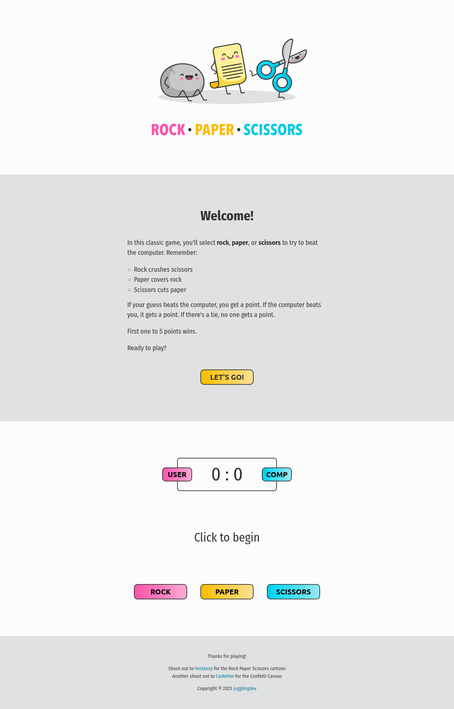

# The Odin Project - Rock Paper Scissors

This is a solution to the [Project: Rock Paper Scissors of the Foundations Course](https://www.theodinproject.com/lessons/foundations-rock-paper-scissors).

## Table of contents

- [Overview](#overview)
  - [Screenshot](#screenshot)
  - [Links](#links)
- [My process](#my-process)
  - [Built with](#built-with)
  - [What I learned](#what-i-learned)
  - [Continued development](#continued-development)
  - [Useful resources](#useful-resources)
- [Author](#author)
- [Acknowledgments](#acknowledgments)

## Overview

### Screenshot

### Links

- Solution URL: [Project: Rock Paper Scissors solution](https://github.com/jugglingdev/rock-paper-scissors)
- Live Site URL: [Project: Rock Paper Scissors live site](https://jugglingdev.github.io/rock-paper-scissors/)

## My process

### Built with

- Semantic HTML
- Custom CSS
- JavaScript
- Google Fonts
- Vecteezy Vectors

### What I learned

Wow!  Being only a week or so into JavaScript, this project took longer than expected as I had to review topics such as functions, loops, and scope.  That said, I'm proud because I really challenged myself to not peek at other solutions for this problem and work a solution by myself using the concepts I knew.  

The biggest thing that helped me do this was breaking down the project into smaller bits.  Once I got a particular function working, I would then move on to the next.  There were some times where I had to go back and tweak a previous function, but this method still helped me stay focused and make steady progress.

The game was originally coded to be played in the console.  Later, I added a colorful UI to build upon my HTML and CSS skills for a fun user experience.  This required refactoring the JavaScript, which was tough but good practice.

For the UI, I had a lot of fun learning how to do beautiful color gradients that don't grey out in the middle.  I found a super useful tool for this task that is linked below.

I also brought back some CSS skills like `flexbox`, `pseudo-classes`, favicons, relative links, and even relative and absolute positioning for the nifty scoreboard and confetti canvas.

A new CSS property I learned was `scroll-behavior: smooth`.  It's perfect for when the user clicks the relative links to scroll down and start the game.  I also used `cursor: pointer` for the second time since the rock, paper, and scissors buttons aren't links that automatically switch the cursor to the pointer style.

You know how some websites just have all these little hidden gems?  Well, since I learned how to `transition` buttons in CSS, I decided to make the `USER` and `COMP` labels as buttons so they could transition on a hover, even though they don't interact with the JavaScript or link anywhere.  It's just one of those sweet things to make the player smile.

Let's talk about the confetti.  If you haven't played it yet, please do so and you'll know what I'm talking about (if you can beat the computer, that is).  This feature makes me so happy, but I did have to work for it!  I haven't worked with anything `<canvas>` before, so this was all based out of my own research.  I knew I wanted a little confetti celebration, and fortunately, I found some code for it from [CodeHim](https://www.codehim.com/animation-effects/javascript-confetti-explosion-effect/).  

z-indez, absolute positioning (fixed???)

transition for buttons - reworked linear-gradient, background bigger

### Continued development

The biggest challenge with this project was figuring out the JavaScript.  I hear so many developers urge coding newbies to work on their logic and I definitely see why!  This is by far the skill I would most like to work on.  In the future, I will seek opportunities to read other developers' code so I can learn how to keep everything clean and tidy.

### Useful resources

- [Picking a Random Item from an Array](https://www.kirupa.com/html5/picking_random_item_from_array.htm) - Helpful little guide for getting the random computer choice.

- [MDN Window.prompt()](https://developer.mozilla.org/en-US/docs/Web/API/Window/prompt) - Good resource for using `prompt()`.

- [MDN Functions](https://developer.mozilla.org/en-US/docs/Web/JavaScript/Guide/Functions) - Good resource for double checking function syntax.

- [MDN Loops and Iteration](https://developer.mozilla.org/en-US/docs/Web/JavaScript/Guide/Loops_and_iteration) - Good resource for understanding loops.

- [Josh W. Comeau - Gradient Generator](https://www.joshwcomeau.com/gradient-generator/) - Massive kudos to Josh for his helpful and generous content.  I'm super impressed with his front-end skills as well as the quality of his educational material.  Can't give thanks enough.

- [Favicon.io](https://favicon.io/) - Generate favicons from text, image, or emojis.

- [fullPage - 10 Best CSS Button Hover Effects](https://alvarotrigo.com/blog/best-css-button-hover-effects/) - Excellent ideas to take that button CSS to the next level.

- [CodeHim - JavaScript Confetti Explosion Effect](https://www.codehim.com/animation-effects/javascript-confetti-explosion-effect/) - HTML, CSS, and JavaScript code to make animated confetti.

- [Interneting Is Hard - Advanced Positioning](https://www.internetingishard.com/html-and-css/advanced-positioning/) - One of my favorite resources for reviewing HTML and CSS concepts like relative and absolute positioning.

## Author

- GitHub - [@jugglingdev](https://github.com/jugglingdev)

- freeCodeCamp - [@jugglingdev](https://www.freecodecamp.org/jugglingdev)

- Frontend Mentor - [@jugglingdev](https://www.frontendmentor.io/profile/jugglingdev)

- LinkedIn - [Kayla Paden](https://www.linkedin.com/in/kayla-marie-paden)

## Acknowledgments

Thank you to [Vecteezy](https://www.vecteezy.com/free-vector/rock-paper-scissors) for the playful rock, paper, scissors cartoon featured in this project.

Another thank you to [Nicholas Suski & Asif Mughal](https://www.codehim.com/animation-effects/javascript-confetti-explosion-effect/) for the confetti code.

As always, shout out to everyone at The Odin Project for chipping in to make web development education free and accessible for everyone.  Huge thanks to you all!